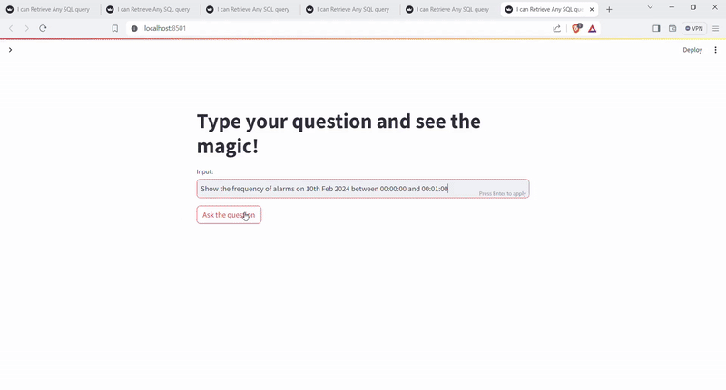

# Natural Language to Dashboard Engine for Manufacturing Alarms

This project enables users to ask natural language questions about **alarm events in a manufacturing plant**, and automatically generates relevant **SQL queries**, **aggregations**, and **visual dashboards** — without needing technical expertise.

## Demo

[
---

## What It Does

- Converts **natural language questions** into **SQL queries** over a manufacturing alarm database.
- Automatically generates **interactive dashboards** (bar charts, bar drilldowns etc.) for visualization.
- Uses **LangGraph** and **LangChain** to create an **agentic workflow**, handling multi-step reasoning such as:
  - Query interpretation
  - Metadata awareness
  - Chart type suggestion
  - Response summarization

---

## Features

- **NL → SQL**: Schema-aware LLM prompting to convert plain English to valid SQL queries.
- **Auto Dashboards**: Renders charts based on query intent using `Plotly` and `Streamlit`.
- **LangGraph-based Agent**: Multi-node agent handles parsing, querying, rendering, and responding.
- **Hallucination Reduction**: Implements schema-anchored prompting and few-shot examples to improve fidelity.
- **Configurable Backend**: Works with SQLite based alarm datasets.

---

## 💻 Tech Stack

| Layer           | Tools & Libraries              |
|----------------|---------------------------------|
| LLM Framework   | `LangChain`, `LangGraph`        |
| LLMs Tested     | `GPT-4o-mini`, `LLaMA`                |
| Visualization   | `Plotly`, `Matplotlib`, `Streamlit` |
| Backend DB      | `SQLite` (demo) |
| Language        | Python 3.10+                    |

---

## 📊 Example Queries

- “What were the top 5 alarms by total duration last week?”
- “Show me the daily alarm count trend for Machine 4.”
- “Compare alarm resolution time for Line A vs. Line B.”
- “Visualize the distribution of alarms by type.”

---

# Sales Assistant for Mercedes Benz Electric Vehicles

- Used llama-index and Cohere Command R+ model.
- Utilized RAG operations to enrich the knowledge base with data from Mercedes and the company's official website.
- Scraped up-to-date information from the Mercedes sales website, ensuring access to the latest data on electric vehicles and their capabilities.

[

