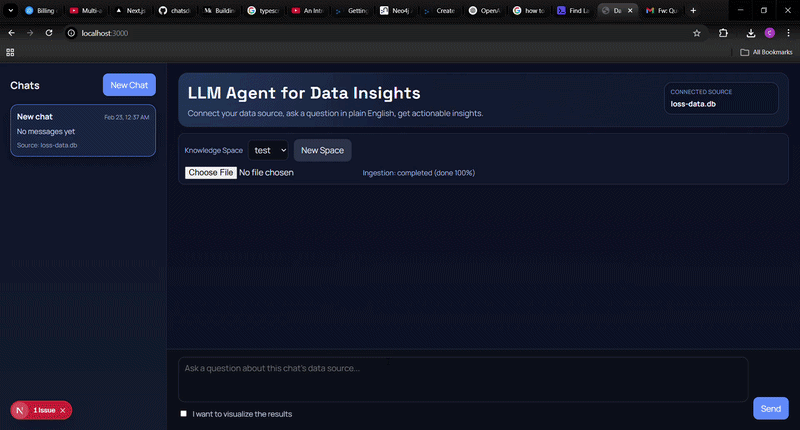

# LLM Agent for Data Insights

This project enables users to ask natural language questions about alarm events in a manufacturing plant and automatically generates relevant SQL queries, aggregations, visual dashboards, and grounded domain insights.

## Demo

---

## What It Does

- Converts natural language questions into schema-aware SQL queries over a manufacturing alarm database
- Automatically generates interactive dashboards (bar charts, drilldowns, trends)
- Produces concise, domain-specific insights via a dedicated query-results summary node

The system is built as a modular LangGraph agent, handling multi-step reasoning across:

- Query interpretation
- Metadata awareness
- SQL generation
- Chart selection
- Insight summarization
---

## Architecture

The agent is exposed via a FastAPI backend and connected to a Next.js frontend for interactive exploration (deployment in progress).

Designed as a multi-node graph for clear separation between reasoning, execution, and presentation layers.

---
## Knowledge-Grounded Summarization (Experimental)

To improve semantic consistency, I experimented with lightweight knowledge graph encoding:

Domain relationships (alarm codes and hierarchies) are represented as a structured adjacency list

This structure is injected into the LLM context to ground summarisation.

Reduces ambiguous interpretations and improves domain-aware explanations

The current implementation uses prompt-injected structure. Future extensions could integrate a graph database for dynamic querying.

## 💻 Tech Stack

| Layer         | Tools                |
| ------------- | -------------------- |
| LLM Framework | LangChain, LangGraph |
| Backend       | FastAPI              |
| Frontend      | Next.js              |
| LLMs Tested   | GPT-5-mini, LLaMA   |
| Visualization | Plotly, Matplotlib   |
| Database      | SQLite               |
| Language      | Python 3.10+         |

---

## 📊 Example Queries

- “What were the top 5 alarms by total duration last week?”
- “Show me the daily alarm count trend for Machine 4.”
- “Compare alarm resolution time for Line A vs. Line B.”
- “Visualize the distribution of alarms by type.”
---

# Policy Graph Explorer (Graph-RAG for Compliance Documents)

Policy Graph Explorer is an end-to-end web application that ingests compliance and policy PDFs, extracts entities and relationships, and constructs a knowledge graph to enable structured exploration of policy documents.

The system allows users to navigate the policy graph visually and query policies through a chat interface, with answers grounded in the underlying documents.

## Demo

## What It Does

- Upload and parse compliance and policy PDF documents
- Extract entities such as policies, requirements, and regulatory concepts
- Construct a typed **knowledge graph** connecting policy relationships
- Provide an interactive **graph visualization** to explore policy dependencies
- Enable **graph-aware retrieval** for answering policy queries
- Allow users to query policies through a chat interface grounded in the source documents

The system combines knowledge graph reasoning with LLM-based retrieval to improve transparency and traceability in policy exploration.

---
## Key Features

- End-to-end full-stack application built with Next.js
- Interactive graph visualization for policy relationships
- Graph-aware retrieval for policy queries
- Streaming chat interface for document exploration
- Deployed on Vercel

## 💻 Tech Stack

| Layer | Tools |
|------|------|
| Framework | Next.js |
| LLM Integration | OpenAI API |
| Visualization | React Force Graph 2D|
| Deployment | Vercel |
| Language | TypeScript|

# Sales Assistant for Mercedes Benz Electric Vehicles

- Used llama-index and Cohere Command R+ model.
- Utilized RAG operations to enrich the knowledge base with data from Mercedes and the company's official website.
- Scraped up-to-date information from the Mercedes sales website, ensuring access to the latest data on electric vehicles and their capabilities.

Code repo: https://github.com/besteaydemir/mercedes-chatbot

[

# **FORRS Energy Price Forecasting Project**  
  → [Case Study + Slides](https://github.com/chatsdude/Forrs_energy_price_forecasting_case_study)  
  → Reduced forecasting error by ~24% compared to baseline, and improved stakeholder trust with SHAP interpretability.

# FitKI
- Built a personalized AI based fitness coach application that provides instant feedback on exercise form and gauges its efficiency
- Helps users attain their fitness objectives and tracks their workout regime
- Deployed REST API endpoints on a cloud server to provide visual analytics to the users to keep track of their progress

Code repo for REST APIs: https://github.com/chatsdude/fitkai

- ## 💻 Tech Stack

| Layer           | Tools & Libraries              |
|----------------|---------------------------------|
| Pose Estimation   | Quick Pose SDK/Mediapipe       |
| Backend Framework | Flask |
| Backend DB      | `SQLite`|
| Language        | Python 3 for backend and Swift for Mobile UI |

[

# Computer Vision and Deep Learning (Project)
### Superpixel Clustering and Post-Hoc correction to improve the performance of cloud segmentation from satellite images

#### Abstract:
We implement a 1D-SEUNet model on Superpixel vectors of satelite images to segment out the cloud from the background. Our method aims to reduce the parameters and increase the speed of a conventional segmentation model.

#### Main Libraries used
- Pytorch
- Fast-SLIC
- Rasterio
- Sklearn (MDS and PCA)

Code repo: https://github.com/SAint7579/ComputerVision_CloudSegmentation

#### Model
</img>

#### Results
</img>

